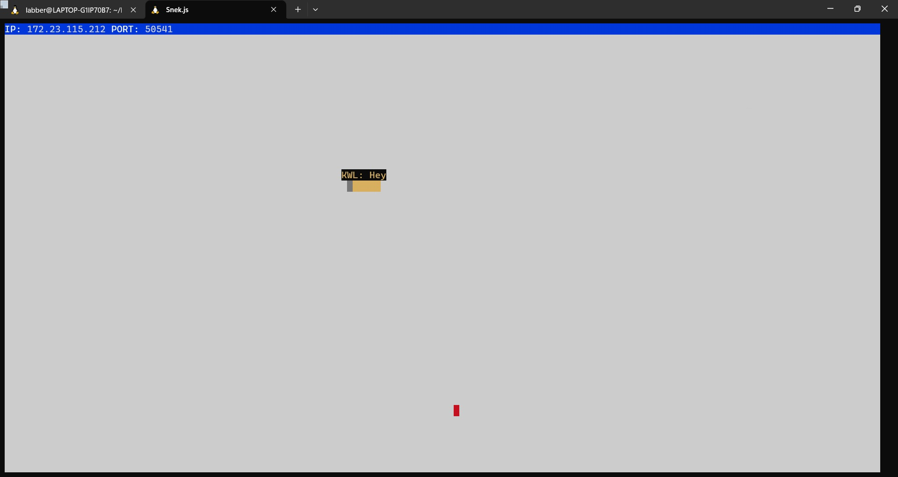
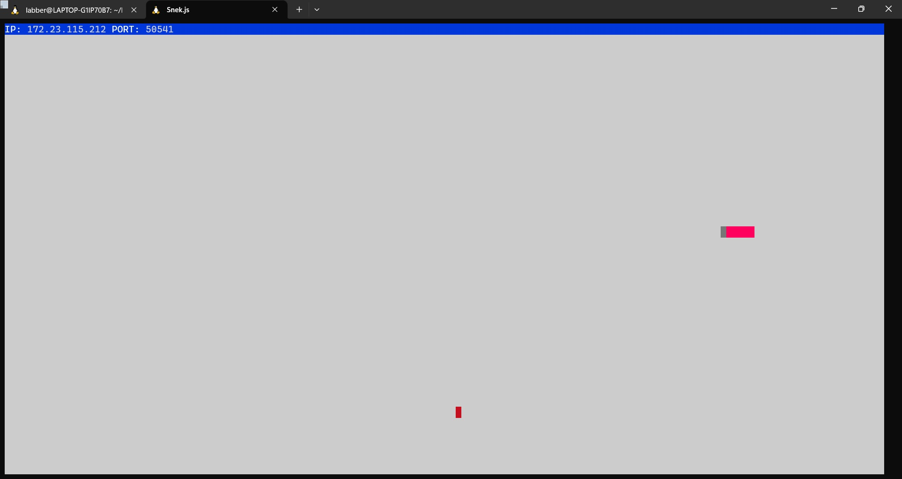
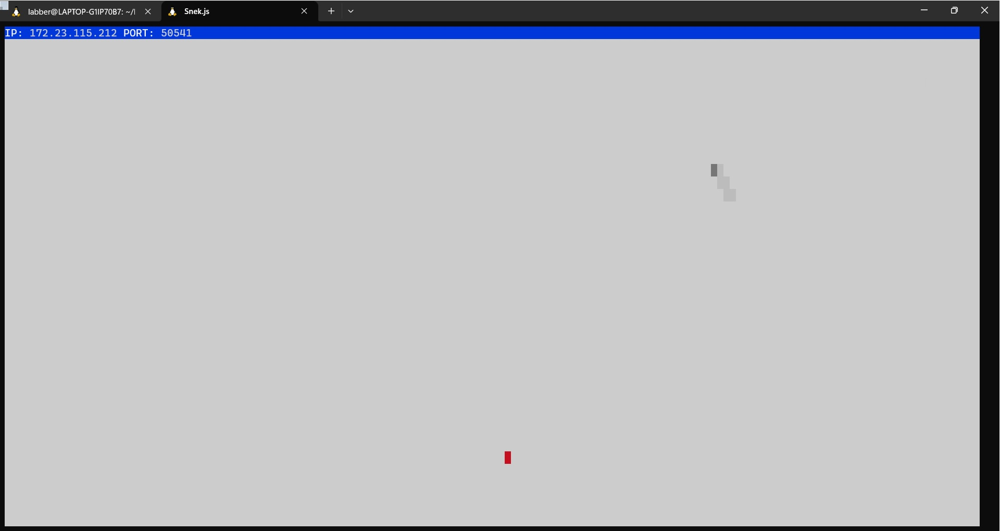
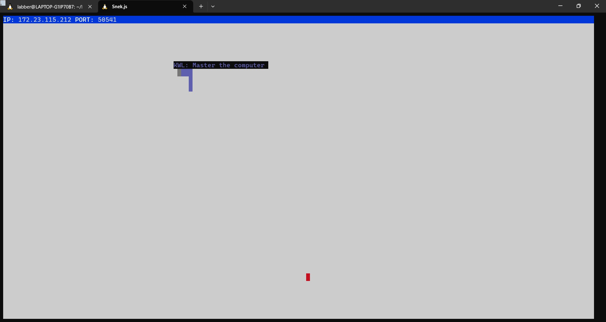

# Snake Client Project
by Kevin, Wing Koon Leung

Snake game is a very popular video game. It is a video game concept where the player maneuvers a dot and grows it by ‘eating’ pieces of food. As it moves and eats, it grows and the growing snake becomes an obstacle to smooth maneuvers. The goal is to grow it to become as big as possible without bumping into the side walls, or bumping into itself, upon which it dies.

This is simply a multiplayer take on the genre.

Before you can run this client, you will need to be running the server side which is included.

## Getting Started

- Follow steps inside the snek server repo to run the server side. Because of the license, the snek server side cannot be uploaded to the repo.
- Run the development snake client using the `node play.js` command.
- You input the key in the client side. The snake and the effect of the key you press shows up in the snek server screen.
1. cd into the snake server `cd snek-multiplayer`
2. start the server `node play.js` (leave this running)
3. cd into the client `cd snake-client`
4. start the client `node play.js`

